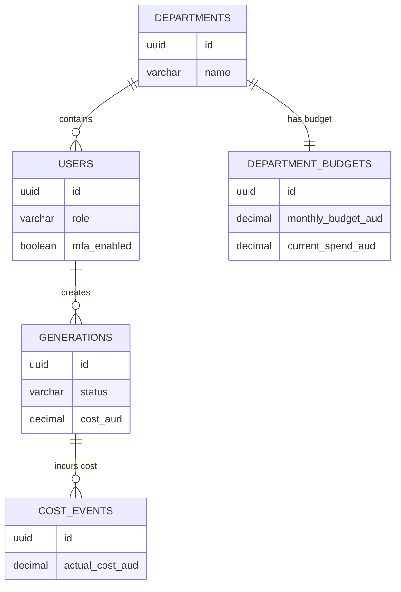
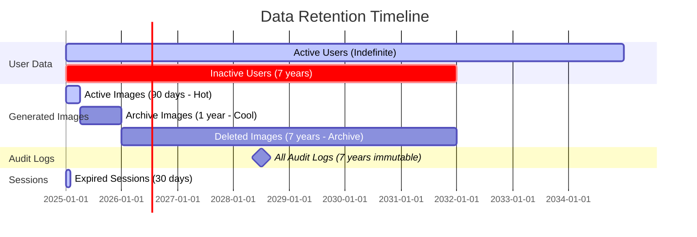

# 🗄️ Database Schema Design
## Enterprise Image Generation Platform (DonatelloAI)

> **Version**: 1.0
> **Date**: 2025-11-17
> **Database**: Azure SQL Database (Primary) + Cosmos DB (Audit Logs)
> **Classification**: CONFIDENTIAL

---

## Table of Contents

1. [Overview](#overview)
2. [Entity Relationship Diagram](#entity-relationship-diagram)
3. [Table Specifications](#table-specifications)
4. [Indexes and Performance](#indexes-and-performance)
5. [Data Retention Policies](#data-retention-policies)
6. [Security and Encryption](#security-and-encryption)
7. [Cosmos DB Schema](#cosmos-db-schema)
8. [Migration Strategy](#migration-strategy)

---

## Overview

### Database Architecture

```
┌────────────────────────────────────────────────────────────┐
│                  RELATIONAL DATA (Azure SQL)                │
│  • User management                                          │
│  • Department and organization data                         │
│  • Generation metadata                                      │
│  • Budget and cost tracking                                 │
│  • Session management                                       │
└────────────────────────────────────────────────────────────┘

┌────────────────────────────────────────────────────────────┐
│                 DOCUMENT DATA (Cosmos DB)                   │
│  • Audit logs (append-only, immutable)                     │
│  • 7-year retention requirement                             │
│  • High-volume write optimization                           │
│  • Partition key: user_id                                   │
└────────────────────────────────────────────────────────────┘

┌────────────────────────────────────────────────────────────┐
│                  BLOB STORAGE (Azure Blob)                  │
│  • Generated images (PNG, JPG)                             │
│  • Thumbnails                                               │
│  • Metadata files (JSON)                                    │
│  • Lifecycle management (Hot → Cool → Archive)             │
└────────────────────────────────────────────────────────────┘

┌────────────────────────────────────────────────────────────┐
│                   CACHE LAYER (Redis)                       │
│  • Session tokens                                           │
│  • User preferences                                         │
│  • Model availability status                                │
│  • Rate limiting counters                                   │
└────────────────────────────────────────────────────────────┘
```

### Design Principles

| Principle | Implementation |
|-----------|----------------|
| **Normalization** | 3NF for transactional data, denormalization for read-heavy tables |
| **Partitioning** | Partition by organization_id for multi-tenancy |
| **Indexing** | Clustered indexes on primary keys, non-clustered on foreign keys |
| **Auditing** | Temporal tables for change tracking, Cosmos DB for audit logs |
| **Encryption** | TDE (Transparent Data Encryption) enabled, Always Encrypted for PII |
| **Backup** | Point-in-time restore (35 days), geo-replicated to Australia Southeast |

---

## Entity Relationship Diagram

### Complete ERD

```mermaid
erDiagram
    ORGANIZATIONS ||--o{ DEPARTMENTS : contains
    ORGANIZATIONS ||--o{ USERS : employs
    DEPARTMENTS ||--o{ USERS : manages
    DEPARTMENTS ||--|| DEPARTMENT_BUDGETS : has
    USERS ||--o{ USER_SESSIONS : creates
    USERS ||--o{ GENERATIONS : requests
    USERS ||--o{ USER_PREFERENCES : configures
    DEPARTMENTS ||--o{ GENERATIONS : funds
    GENERATIONS ||--|| GENERATION_METADATA : details
    GENERATIONS ||--o{ COST_EVENTS : incurs
    DEPARTMENTS ||--o{ COST_EVENTS : pays
    MODEL_PROVIDERS ||--o{ GENERATIONS : processes
    MODEL_PROVIDERS ||--|| PROVIDER_CONFIGS : configured_by
    USERS ||--o{ API_KEYS : owns
    USERS ||--o{ WEBHOOKS : configures

    ORGANIZATIONS {
        uuid id PK
        varchar name
        varchar domain
        boolean is_active
        timestamp created_at
        timestamp updated_at
        jsonb settings
    }

    DEPARTMENTS {
        uuid id PK
        uuid organization_id FK
        varchar name
        varchar code
        boolean is_active
        timestamp created_at
        timestamp updated_at
        jsonb settings
    }

    USERS {
        uuid id PK
        uuid organization_id FK
        uuid department_id FK
        varchar azure_ad_id UK
        varchar email UK
        varchar display_name
        varchar role
        boolean is_active
        boolean mfa_enabled
        timestamp mfa_grace_period_expires_at
        timestamp last_login_at
        timestamp created_at
        timestamp updated_at
        jsonb settings
    }

    USER_SESSIONS {
        uuid id PK
        uuid user_id FK
        varchar refresh_token_hash UK
        jsonb device_info
        timestamp created_at
        timestamp expires_at
        timestamp last_used_at
        boolean revoked
        timestamp revoked_at
        varchar revoked_reason
    }

    USER_PREFERENCES {
        uuid id PK
        uuid user_id FK
        varchar preference_key
        jsonb preference_value
        timestamp created_at
        timestamp updated_at
    }

    DEPARTMENT_BUDGETS {
        uuid id PK
        uuid department_id FK UK
        decimal monthly_budget_aud
        decimal current_spend_aud
        date budget_period_start
        date budget_period_end
        varchar enforcement_mode
        timestamp last_reset_at
        timestamp created_at
        timestamp updated_at
    }

    GENERATIONS {
        uuid id PK
        uuid user_id FK
        uuid department_id FK
        varchar model_provider
        varchar model_name
        text prompt_encrypted
        varchar status
        varchar image_url
        varchar thumbnail_url
        decimal cost_aud
        int generation_time_ms
        varchar error_message
        boolean is_nsfw
        boolean is_deleted
        timestamp created_at
        timestamp completed_at
        timestamp deleted_at
        jsonb metadata
    }

    GENERATION_METADATA {
        uuid id PK
        uuid generation_id FK UK
        varchar prompt_language
        float prompt_complexity_score
        varchar selected_model_reason
        varchar fallback_model
        int retry_count
        jsonb model_parameters
        jsonb post_processing_steps
        varchar content_safety_score
        timestamp created_at
    }

    COST_EVENTS {
        uuid id PK
        uuid generation_id FK
        uuid department_id FK
        uuid user_id FK
        varchar model_provider
        decimal estimated_cost_aud
        decimal actual_cost_aud
        varchar currency
        timestamp created_at
        jsonb metadata
    }

    MODEL_PROVIDERS {
        uuid id PK
        varchar provider_name UK
        varchar model_name
        boolean is_active
        varchar api_endpoint
        decimal cost_per_image_aud
        float sla_percentage
        int timeout_seconds
        timestamp created_at
        timestamp updated_at
    }

    PROVIDER_CONFIGS {
        uuid id PK
        uuid provider_id FK UK
        varchar api_key_vault_ref
        int max_retries
        int rate_limit_per_minute
        jsonb configuration
        timestamp created_at
        timestamp updated_at
    }

    API_KEYS {
        uuid id PK
        uuid user_id FK
        varchar key_name
        varchar key_hash
        varchar key_prefix
        boolean is_active
        timestamp expires_at
        timestamp last_used_at
        timestamp created_at
        timestamp revoked_at
    }

    WEBHOOKS {
        uuid id PK
        uuid user_id FK
        varchar webhook_url
        varchar secret_hash
        jsonb event_types
        boolean is_active
        int retry_count
        timestamp created_at
        timestamp updated_at
    }
```

### Core Tables Relationship



---

## Table Specifications

### 1. ORGANIZATIONS

Stores top-level organization (tenant) information for multi-tenancy support.

```sql
CREATE TABLE organizations (
    id                  UUID PRIMARY KEY DEFAULT gen_random_uuid(),
    name                VARCHAR(255) NOT NULL,
    domain              VARCHAR(255) NOT NULL,
    is_active           BOOLEAN DEFAULT true,
    created_at          TIMESTAMP DEFAULT CURRENT_TIMESTAMP,
    updated_at          TIMESTAMP DEFAULT CURRENT_TIMESTAMP,
    settings            JSONB DEFAULT '{}'::jsonb,

    CONSTRAINT chk_domain CHECK (domain ~ '^[a-zA-Z0-9][a-zA-Z0-9-]{1,61}[a-zA-Z0-9]\.[a-zA-Z]{2,}$')
);

CREATE UNIQUE INDEX idx_organizations_domain ON organizations(domain) WHERE is_active = true;
CREATE INDEX idx_organizations_created_at ON organizations(created_at DESC);

COMMENT ON TABLE organizations IS 'Top-level tenant organizations';
COMMENT ON COLUMN organizations.settings IS 'JSON configuration: {theme, timezone, locale, features_enabled}';
```

**Sample Data**:
```json
{
  "id": "550e8400-e29b-41d4-a716-446655440000",
  "name": "Acme Corporation",
  "domain": "acme.com.au",
  "is_active": true,
  "settings": {
    "theme": "light",
    "timezone": "Australia/Sydney",
    "locale": "en-AU",
    "features_enabled": ["batch_generation", "api_access"]
  }
}
```

---

### 2. DEPARTMENTS

Organizational units within an organization for budget and user management.

```sql
CREATE TABLE departments (
    id                  UUID PRIMARY KEY DEFAULT gen_random_uuid(),
    organization_id     UUID NOT NULL REFERENCES organizations(id) ON DELETE CASCADE,
    name                VARCHAR(255) NOT NULL,
    code                VARCHAR(50) NOT NULL,
    is_active           BOOLEAN DEFAULT true,
    created_at          TIMESTAMP DEFAULT CURRENT_TIMESTAMP,
    updated_at          TIMESTAMP DEFAULT CURRENT_TIMESTAMP,
    settings            JSONB DEFAULT '{}'::jsonb,

    CONSTRAINT uq_dept_org_code UNIQUE(organization_id, code)
);

CREATE INDEX idx_departments_organization_id ON departments(organization_id);
CREATE INDEX idx_departments_code ON departments(code);
CREATE INDEX idx_departments_is_active ON departments(is_active) WHERE is_active = true;

COMMENT ON TABLE departments IS 'Organizational departments for budget allocation and user grouping';
COMMENT ON COLUMN departments.code IS 'Short identifier for the department (e.g., MKTG, ENGG, SALES)';
```

**Sample Data**:
```json
{
  "id": "660e8400-e29b-41d4-a716-446655440000",
  "organization_id": "550e8400-e29b-41d4-a716-446655440000",
  "name": "Marketing",
  "code": "MKTG",
  "is_active": true,
  "settings": {
    "default_model": "dall-e-3",
    "quality_preference": "high",
    "cost_weight": 0.3
  }
}
```

---

### 3. USERS

User accounts with role-based access control.

```sql
CREATE TABLE users (
    id                              UUID PRIMARY KEY DEFAULT gen_random_uuid(),
    organization_id                 UUID NOT NULL REFERENCES organizations(id) ON DELETE CASCADE,
    department_id                   UUID REFERENCES departments(id) ON DELETE SET NULL,
    azure_ad_id                     VARCHAR(255) UNIQUE NOT NULL,
    email                           VARCHAR(255) UNIQUE NOT NULL,
    display_name                    VARCHAR(255),
    role                            VARCHAR(50) NOT NULL CHECK (role IN (
                                        'super_admin',
                                        'org_admin',
                                        'dept_manager',
                                        'power_user',
                                        'standard_user'
                                    )),
    is_active                       BOOLEAN DEFAULT true,
    mfa_enabled                     BOOLEAN DEFAULT false,
    mfa_grace_period_expires_at     TIMESTAMP,
    last_login_at                   TIMESTAMP,
    created_at                      TIMESTAMP DEFAULT CURRENT_TIMESTAMP,
    updated_at                      TIMESTAMP DEFAULT CURRENT_TIMESTAMP,
    settings                        JSONB DEFAULT '{}'::jsonb
);

CREATE INDEX idx_users_organization_id ON users(organization_id);
CREATE INDEX idx_users_department_id ON users(department_id);
CREATE INDEX idx_users_azure_ad_id ON users(azure_ad_id);
CREATE INDEX idx_users_email ON users(email);
CREATE INDEX idx_users_role ON users(role);
CREATE INDEX idx_users_is_active ON users(is_active) WHERE is_active = true;
CREATE INDEX idx_users_last_login ON users(last_login_at DESC NULLS LAST);

COMMENT ON TABLE users IS 'User accounts with RBAC';
COMMENT ON COLUMN users.azure_ad_id IS 'Azure AD Object ID for SSO integration';
COMMENT ON COLUMN users.mfa_grace_period_expires_at IS 'Deadline for MFA setup (7 days from account creation)';
```

**Sample Data**:
```json
{
  "id": "770e8400-e29b-41d4-a716-446655440000",
  "organization_id": "550e8400-e29b-41d4-a716-446655440000",
  "department_id": "660e8400-e29b-41d4-a716-446655440000",
  "azure_ad_id": "12345678-1234-1234-1234-123456789012",
  "email": "john.doe@acme.com.au",
  "display_name": "John Doe",
  "role": "power_user",
  "is_active": true,
  "mfa_enabled": true,
  "last_login_at": "2025-11-17T10:30:00Z",
  "settings": {
    "notifications_enabled": true,
    "preferred_model": "dall-e-3",
    "auto_download": false
  }
}
```

---

### 4. USER_SESSIONS

Active user sessions for token management and revocation.

```sql
CREATE TABLE user_sessions (
    id                      UUID PRIMARY KEY DEFAULT gen_random_uuid(),
    user_id                 UUID NOT NULL REFERENCES users(id) ON DELETE CASCADE,
    refresh_token_hash      VARCHAR(255) UNIQUE NOT NULL,
    device_info             JSONB,
    created_at              TIMESTAMP DEFAULT CURRENT_TIMESTAMP,
    expires_at              TIMESTAMP NOT NULL,
    last_used_at            TIMESTAMP DEFAULT CURRENT_TIMESTAMP,
    revoked                 BOOLEAN DEFAULT false,
    revoked_at              TIMESTAMP,
    revoked_reason          VARCHAR(255),

    CONSTRAINT chk_revoked_at CHECK (
        (revoked = false AND revoked_at IS NULL) OR
        (revoked = true AND revoked_at IS NOT NULL)
    )
);

CREATE INDEX idx_sessions_user_id ON user_sessions(user_id);
CREATE INDEX idx_sessions_refresh_token_hash ON user_sessions(refresh_token_hash);
CREATE INDEX idx_sessions_expires_at ON user_sessions(expires_at);
CREATE INDEX idx_sessions_active ON user_sessions(user_id, expires_at)
    WHERE revoked = false AND expires_at > CURRENT_TIMESTAMP;

COMMENT ON TABLE user_sessions IS 'User session tracking for token management';
COMMENT ON COLUMN user_sessions.refresh_token_hash IS 'SHA-256 hash of refresh token for secure storage';
COMMENT ON COLUMN user_sessions.device_info IS 'JSON: {user_agent, ip_address, device_type, browser}';
```

**Sample Data**:
```json
{
  "id": "880e8400-e29b-41d4-a716-446655440000",
  "user_id": "770e8400-e29b-41d4-a716-446655440000",
  "refresh_token_hash": "5e884898da28047151d0e56f8dc6292773603d0d6aabbdd62a11ef721d1542d8",
  "device_info": {
    "user_agent": "Mozilla/5.0 (Windows NT 10.0; Win64; x64) AppleWebKit/537.36",
    "ip_address": "203.0.113.42",
    "device_type": "desktop",
    "browser": "Chrome 120"
  },
  "created_at": "2025-11-17T08:00:00Z",
  "expires_at": "2025-11-24T08:00:00Z",
  "last_used_at": "2025-11-17T10:30:00Z",
  "revoked": false
}
```

---

### 5. DEPARTMENT_BUDGETS

Budget allocation and tracking for departments.

```sql
CREATE TABLE department_budgets (
    id                      UUID PRIMARY KEY DEFAULT gen_random_uuid(),
    department_id           UUID UNIQUE NOT NULL REFERENCES departments(id) ON DELETE CASCADE,
    monthly_budget_aud      DECIMAL(10,2) NOT NULL CHECK (monthly_budget_aud >= 0),
    current_spend_aud       DECIMAL(10,2) DEFAULT 0.00 CHECK (current_spend_aud >= 0),
    budget_period_start     DATE NOT NULL,
    budget_period_end       DATE NOT NULL,
    enforcement_mode        VARCHAR(10) NOT NULL CHECK (enforcement_mode IN ('hard', 'soft', 'warn')) DEFAULT 'hard',
    last_reset_at           TIMESTAMP,
    created_at              TIMESTAMP DEFAULT CURRENT_TIMESTAMP,
    updated_at              TIMESTAMP DEFAULT CURRENT_TIMESTAMP,

    CONSTRAINT chk_budget_period CHECK (budget_period_end > budget_period_start)
);

CREATE INDEX idx_dept_budgets_department_id ON department_budgets(department_id);
CREATE INDEX idx_dept_budgets_period ON department_budgets(budget_period_start, budget_period_end);
CREATE INDEX idx_dept_budgets_utilization ON department_budgets(
    (current_spend_aud / NULLIF(monthly_budget_aud, 0))
) WHERE monthly_budget_aud > 0;

COMMENT ON TABLE department_budgets IS 'Monthly budget allocations and spend tracking';
COMMENT ON COLUMN department_budgets.enforcement_mode IS 'hard: block, soft: allow+log, warn: alert+allow';
```

**Sample Data**:
```json
{
  "id": "990e8400-e29b-41d4-a716-446655440000",
  "department_id": "660e8400-e29b-41d4-a716-446655440000",
  "monthly_budget_aud": 5000.00,
  "current_spend_aud": 3250.50,
  "budget_period_start": "2025-11-01",
  "budget_period_end": "2025-11-30",
  "enforcement_mode": "hard",
  "last_reset_at": "2025-11-01T00:00:00Z"
}
```

---

### 6. GENERATIONS

Image generation requests and their results.

```sql
CREATE TABLE generations (
    id                      UUID PRIMARY KEY DEFAULT gen_random_uuid(),
    user_id                 UUID NOT NULL REFERENCES users(id) ON DELETE CASCADE,
    department_id           UUID NOT NULL REFERENCES departments(id) ON DELETE CASCADE,
    model_provider          VARCHAR(50) NOT NULL,
    model_name              VARCHAR(100) NOT NULL,
    prompt_encrypted        TEXT NOT NULL,
    status                  VARCHAR(20) NOT NULL CHECK (status IN (
                                'pending', 'processing', 'completed', 'failed', 'cancelled'
                            )) DEFAULT 'pending',
    image_url               VARCHAR(500),
    thumbnail_url           VARCHAR(500),
    cost_aud                DECIMAL(10,4) DEFAULT 0.0000,
    generation_time_ms      INT,
    error_message           TEXT,
    is_nsfw                 BOOLEAN DEFAULT false,
    is_deleted              BOOLEAN DEFAULT false,
    created_at              TIMESTAMP DEFAULT CURRENT_TIMESTAMP,
    completed_at            TIMESTAMP,
    deleted_at              TIMESTAMP,
    metadata                JSONB DEFAULT '{}'::jsonb,

    CONSTRAINT chk_completed CHECK (
        (status = 'completed' AND completed_at IS NOT NULL AND image_url IS NOT NULL) OR
        (status != 'completed')
    )
);

CREATE INDEX idx_generations_user_id ON generations(user_id);
CREATE INDEX idx_generations_department_id ON generations(department_id);
CREATE INDEX idx_generations_status ON generations(status);
CREATE INDEX idx_generations_created_at ON generations(created_at DESC);
CREATE INDEX idx_generations_model_provider ON generations(model_provider);
CREATE INDEX idx_generations_active ON generations(user_id, created_at DESC)
    WHERE is_deleted = false;

COMMENT ON TABLE generations IS 'Image generation requests and results';
COMMENT ON COLUMN generations.prompt_encrypted IS 'Encrypted prompt using application-level encryption';
COMMENT ON COLUMN generations.metadata IS 'JSON: {resolution, style, negative_prompt, seed}';
```

**Sample Data**:
```json
{
  "id": "aa0e8400-e29b-41d4-a716-446655440000",
  "user_id": "770e8400-e29b-41d4-a716-446655440000",
  "department_id": "660e8400-e29b-41d4-a716-446655440000",
  "model_provider": "azure-openai",
  "model_name": "dall-e-3",
  "prompt_encrypted": "AES256_ENCRYPTED_DATA_HERE",
  "status": "completed",
  "image_url": "https://cdn.donatelloai.com/images/2025/11/17/aa0e8400.png",
  "thumbnail_url": "https://cdn.donatelloai.com/images/2025/11/17/aa0e8400_thumb.jpg",
  "cost_aud": 0.0800,
  "generation_time_ms": 12450,
  "is_nsfw": false,
  "is_deleted": false,
  "created_at": "2025-11-17T10:30:00Z",
  "completed_at": "2025-11-17T10:30:12Z",
  "metadata": {
    "resolution": "1024x1024",
    "quality": "hd",
    "style": "vivid",
    "user_ip": "203.0.113.42"
  }
}
```

---

### 7. GENERATION_METADATA

Detailed metadata for generation tracking and analytics.

```sql
CREATE TABLE generation_metadata (
    id                          UUID PRIMARY KEY DEFAULT gen_random_uuid(),
    generation_id               UUID UNIQUE NOT NULL REFERENCES generations(id) ON DELETE CASCADE,
    prompt_language             VARCHAR(10),
    prompt_complexity_score     FLOAT CHECK (prompt_complexity_score BETWEEN 0 AND 1),
    selected_model_reason       VARCHAR(255),
    fallback_model              VARCHAR(100),
    retry_count                 INT DEFAULT 0,
    model_parameters            JSONB,
    post_processing_steps       JSONB,
    content_safety_score        VARCHAR(50),
    created_at                  TIMESTAMP DEFAULT CURRENT_TIMESTAMP
);

CREATE INDEX idx_gen_metadata_generation_id ON generation_metadata(generation_id);
CREATE INDEX idx_gen_metadata_complexity ON generation_metadata(prompt_complexity_score);
CREATE INDEX idx_gen_metadata_retry_count ON generation_metadata(retry_count) WHERE retry_count > 0;

COMMENT ON TABLE generation_metadata IS 'Detailed analytics and decision tracking for generations';
COMMENT ON COLUMN generation_metadata.selected_model_reason IS 'Why this model was chosen (e.g., cost-optimized, quality-focused)';
```

---

### 8. COST_EVENTS

Financial transactions for cost tracking.

```sql
CREATE TABLE cost_events (
    id                      UUID PRIMARY KEY DEFAULT gen_random_uuid(),
    generation_id           UUID NOT NULL REFERENCES generations(id) ON DELETE CASCADE,
    department_id           UUID NOT NULL REFERENCES departments(id) ON DELETE CASCADE,
    user_id                 UUID NOT NULL REFERENCES users(id) ON DELETE CASCADE,
    model_provider          VARCHAR(50) NOT NULL,
    estimated_cost_aud      DECIMAL(10,4) NOT NULL,
    actual_cost_aud         DECIMAL(10,4) NOT NULL,
    currency                VARCHAR(3) DEFAULT 'AUD',
    created_at              TIMESTAMP DEFAULT CURRENT_TIMESTAMP,
    metadata                JSONB DEFAULT '{}'::jsonb
);

CREATE INDEX idx_cost_events_department_id ON cost_events(department_id);
CREATE INDEX idx_cost_events_user_id ON cost_events(user_id);
CREATE INDEX idx_cost_events_created_at ON cost_events(created_at DESC);
CREATE INDEX idx_cost_events_model_provider ON cost_events(model_provider);

COMMENT ON TABLE cost_events IS 'Granular cost tracking for budgeting and analytics';
COMMENT ON COLUMN cost_events.metadata IS 'JSON: {billing_period, invoice_id, tax_amount}';
```

---

### 9. MODEL_PROVIDERS

Configuration for AI model providers.

```sql
CREATE TABLE model_providers (
    id                      UUID PRIMARY KEY DEFAULT gen_random_uuid(),
    provider_name           VARCHAR(100) UNIQUE NOT NULL,
    model_name              VARCHAR(100) NOT NULL,
    is_active               BOOLEAN DEFAULT true,
    api_endpoint            VARCHAR(500) NOT NULL,
    cost_per_image_aud      DECIMAL(10,4) NOT NULL,
    sla_percentage          FLOAT CHECK (sla_percentage BETWEEN 0 AND 100),
    timeout_seconds         INT DEFAULT 60,
    created_at              TIMESTAMP DEFAULT CURRENT_TIMESTAMP,
    updated_at              TIMESTAMP DEFAULT CURRENT_TIMESTAMP,

    CONSTRAINT uq_provider_model UNIQUE(provider_name, model_name)
);

CREATE INDEX idx_model_providers_is_active ON model_providers(is_active) WHERE is_active = true;
CREATE INDEX idx_model_providers_cost ON model_providers(cost_per_image_aud);

COMMENT ON TABLE model_providers IS 'AI model provider configurations';
```

---

## Indexes and Performance

### Index Strategy

| Index Type | Purpose | Tables |
|------------|---------|--------|
| **Clustered** | Primary key ordering | All tables (on `id`) |
| **Non-Clustered** | Foreign key lookups | All FK columns |
| **Partial** | Filter active records | `is_active = true` columns |
| **Composite** | Multi-column queries | `(user_id, created_at)` |
| **Expression** | Computed columns | Budget utilization percentage |

### Query Optimization Examples

```sql
-- Fast user generation history (uses composite index)
SELECT * FROM generations
WHERE user_id = $1 AND is_deleted = false
ORDER BY created_at DESC
LIMIT 20;

-- Fast department budget check (uses expression index)
SELECT department_id,
       current_spend_aud,
       monthly_budget_aud,
       (current_spend_aud / monthly_budget_aud * 100) as utilization_pct
FROM department_budgets
WHERE (current_spend_aud / monthly_budget_aud) > 0.80;

-- Fast active session lookup (uses partial index)
SELECT * FROM user_sessions
WHERE user_id = $1
  AND revoked = false
  AND expires_at > CURRENT_TIMESTAMP;
```

---

## Data Retention Policies

### Retention Schedule



### Automated Cleanup Jobs

```sql
-- Daily cleanup of expired sessions
DELETE FROM user_sessions
WHERE expires_at < CURRENT_TIMESTAMP - INTERVAL '30 days';

-- Monthly archive of old generations
UPDATE generations
SET is_deleted = true, deleted_at = CURRENT_TIMESTAMP
WHERE created_at < CURRENT_TIMESTAMP - INTERVAL '90 days'
  AND is_deleted = false;

-- Annual deletion of soft-deleted data
DELETE FROM generations
WHERE is_deleted = true
  AND deleted_at < CURRENT_TIMESTAMP - INTERVAL '7 years';
```

---

## Security and Encryption

### Encryption Strategy

| Data Type | Encryption Method | Key Management |
|-----------|------------------|----------------|
| **At Rest** | TDE (Transparent Data Encryption) | Azure Key Vault |
| **Sensitive Columns** | Always Encrypted | Column Encryption Key |
| **Prompts** | Application-level AES-256 | Azure Key Vault |
| **PII** | Always Encrypted (Deterministic) | Column Master Key |
| **Tokens** | SHA-256 Hash | Application Salt |
| **Backups** | Automatic with TDE | Same as primary |

### Always Encrypted Example

```sql
-- Encrypt sensitive columns (requires client-side setup)
ALTER TABLE users
ALTER COLUMN email
ADD ENCRYPTED WITH (
    COLUMN_ENCRYPTION_KEY = CEK_Email,
    ENCRYPTION_TYPE = Deterministic,
    ALGORITHM = 'AEAD_AES_256_CBC_HMAC_SHA_256'
);

ALTER TABLE generations
ALTER COLUMN prompt_encrypted
ADD ENCRYPTED WITH (
    COLUMN_ENCRYPTION_KEY = CEK_Prompts,
    ENCRYPTION_TYPE = Randomized,
    ALGORITHM = 'AEAD_AES_256_CBC_HMAC_SHA_256'
);
```

---

## Cosmos DB Schema

### Audit Logs Container

**Database**: `donatelloai-audit`
**Container**: `audit_logs`
**Partition Key**: `/user_id`
**Throughput**: 4000 RU/s (autoscale to 40,000)
**TTL**: 220,896,000 seconds (7 years)

```json
{
  "id": "unique-uuid",
  "user_id": "770e8400-e29b-41d4-a716-446655440000",
  "timestamp": "2025-11-17T10:30:00.000Z",
  "event_type": "generation.completed",
  "action": "image_generated",
  "resource_type": "generation",
  "resource_id": "aa0e8400-e29b-41d4-a716-446655440000",
  "user_email": "john.doe@acme.com.au",
  "ip_address": "203.0.113.42",
  "user_agent": "Mozilla/5.0...",
  "request_id": "req-12345-67890",
  "status": "success",
  "error_message": null,
  "metadata": {
    "model_used": "dall-e-3",
    "cost_aud": 0.08,
    "generation_time_ms": 12450,
    "department_id": "660e8400-e29b-41d4-a716-446655440000"
  },
  "_ts": 1700221800
}
```

### Indexed Properties

```javascript
// Cosmos DB indexing policy
{
  "indexingMode": "consistent",
  "automatic": true,
  "includedPaths": [
    {"path": "/user_id/?"},
    {"path": "/timestamp/?"},
    {"path": "/event_type/?"},
    {"path": "/resource_id/?"},
    {"path": "/status/?"}
  ],
  "excludedPaths": [
    {"path": "/metadata/*"},
    {"path": "/user_agent/?"}
  ]
}
```

---

## Migration Strategy

### Alembic Migrations

```python
# alembic/versions/001_initial_schema.py
def upgrade():
    op.create_table(
        'organizations',
        sa.Column('id', postgresql.UUID(as_uuid=True), nullable=False),
        sa.Column('name', sa.VARCHAR(255), nullable=False),
        sa.Column('domain', sa.VARCHAR(255), nullable=False),
        sa.Column('is_active', sa.BOOLEAN(), default=True),
        sa.Column('created_at', sa.TIMESTAMP(), server_default=sa.text('CURRENT_TIMESTAMP')),
        sa.Column('updated_at', sa.TIMESTAMP(), server_default=sa.text('CURRENT_TIMESTAMP')),
        sa.Column('settings', postgresql.JSONB(), server_default=sa.text("'{}'::jsonb")),
        sa.PrimaryKeyConstraint('id')
    )
    # ... more tables

def downgrade():
    op.drop_table('organizations')
    # ... more tables
```

### Migration Checklist

- [ ] Run migration on development environment
- [ ] Validate data integrity
- [ ] Test application compatibility
- [ ] Backup production database
- [ ] Run migration during maintenance window
- [ ] Validate production data
- [ ] Monitor performance metrics
- [ ] Rollback plan ready

---

**Document Control**

| Field | Value |
|-------|-------|
| Version | 1.0 |
| Author | DonatelloAI Data Team |
| Date | 2025-11-17 |
| Review Date | 2026-02-17 |
| Classification | CONFIDENTIAL |

---

**Related Documentation**:
- [System Architecture](SYSTEM_ARCHITECTURE.md)
- [API Specification](../api/openapi.yaml)
- [Data Flow Diagrams](../diagrams/DATA_FLOW_DIAGRAMS.md)
- [Security Architecture](SECURITY_ARCHITECTURE.md)
