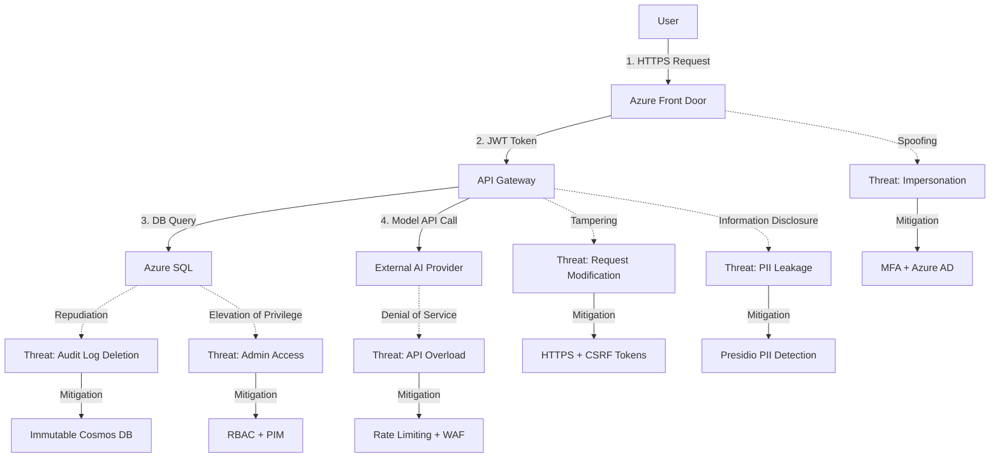

# 🔐 Security Architecture
## DonatelloAI Enterprise Image Generation Platform

> **Version**: 1.0
> **Date**: 2025-11-17
> **Classification**: CONFIDENTIAL
> **ISO 27001 Controls**: All Annexes A.5-A.18

---

## Security Overview

### Defense in Depth Strategy

```
┌─────────────────────────────────────────────────────────┐
│ Layer 7: Physical Security (Azure Data Centers)         │
│ • Biometric access, 24/7 security, video surveillance   │
└─────────────────────────────────────────────────────────┘
┌─────────────────────────────────────────────────────────┐
│ Layer 6: Network Security                               │
│ • Azure vNET isolation, NSGs, DDoS Protection Standard  │
└─────────────────────────────────────────────────────────┘
┌─────────────────────────────────────────────────────────┐
│ Layer 5: Perimeter Security                             │
│ • WAF (OWASP Top 10), Azure Front Door, Geo-filtering   │
└─────────────────────────────────────────────────────────┘
┌─────────────────────────────────────────────────────────┐
│ Layer 4: Identity & Access                              │
│ • Azure AD + MFA, RBAC, PIM, Conditional Access         │
└─────────────────────────────────────────────────────────┘
┌─────────────────────────────────────────────────────────┐
│ Layer 3: Application Security                           │
│ • Input validation, output encoding, CSRF protection    │
└─────────────────────────────────────────────────────────┘
┌─────────────────────────────────────────────────────────┐
│ Layer 2: Data Security                                  │
│ • TDE, Always Encrypted, TLS 1.3, Key Vault             │
└─────────────────────────────────────────────────────────┘
┌─────────────────────────────────────────────────────────┐
│ Layer 1: Monitoring & Response                          │
│ • Sentinel SIEM, Defender for Cloud, Audit Logging      │
└─────────────────────────────────────────────────────────┘
```

### Security Principles

- **Zero Trust**: Never trust, always verify
- **Least Privilege**: Minimum necessary access
- **Encryption Everywhere**: At rest and in transit
- **Audit Everything**: Immutable logs for 7 years
- **Assume Breach**: Detection and response capabilities

---

## ISO 27001 Control Implementation

### A.9: Access Control

**A.9.2.1 User Registration**:
- ✅ Automated provisioning via Azure AD
- ✅ Approval workflow for privileged roles
- ✅ MFA enforcement (7-day grace period)

**A.9.4.2 Secure Log-on**:
- ✅ OAuth 2.0 + OpenID Connect
- ✅ JWT tokens (30-min access, 7-day refresh)
- ✅ Session timeout after inactivity
- ✅ Concurrent session limits (2 devices)

### A.12: Operations Security

**A.12.1.2 Change Management**:
- ✅ GitOps-based deployments
- ✅ Blue-green deployment strategy
- ✅ Automated rollback capabilities
- ✅ Change advisory board approval for production

**A.12.6 Technical Vulnerability Management**:
- ✅ Weekly dependency scans (Snyk, npm audit)
- ✅ Container scanning (Trivy)
- ✅ SAST (Bandit, SonarQube)
- ✅ Penetration testing (quarterly)

### A.13: Communications Security

**A.13.1.1 Network Controls**:
- ✅ TLS 1.3 enforcement
- ✅ Certificate management (Azure Key Vault)
- ✅ HSTS headers (max-age=31536000)
- ✅ Network segmentation (AKS network policies)

### A.14: System Acquisition

**A.14.2.1 Secure Development**:
- ✅ OWASP ASVS Level 2 compliance
- ✅ Code review requirements (2 approvals)
- ✅ Pre-commit hooks (linting, secrets detection)
- ✅ Dependency pinning and verification

### A.16: Incident Management

**A.16.1.1 Responsibilities**:
- ✅ 24/7 on-call rotation
- ✅ Incident response playbooks
- ✅ <15 min detection, <30 min response
- ✅ Post-incident reviews (PIRs)

---

## Threat Model

### STRIDE Analysis



### Critical Assets

| Asset | Confidentiality | Integrity | Availability | Protection |
|-------|----------------|-----------|--------------|------------|
| User Credentials | Critical | Critical | High | Azure AD, MFA, encryption |
| Generated Images | High | High | High | Blob encryption, access control |
| Prompts | High | Medium | Medium | Database encryption, PII detection |
| Audit Logs | Medium | Critical | High | Cosmos DB immutability |
| API Keys | Critical | Critical | High | Key Vault, rotation, least privilege |
| Budget Data | High | Critical | High | RBAC, audit trail |

---

## Authentication & Authorization

### OAuth 2.0 Flow

```
┌──────┐                                    ┌─────────────┐
│User  │                                    │  Azure AD   │
└──┬───┘                                    └──────┬──────┘
   │ 1. GET /login                                 │
   ├──────────────────────────────────────────────►│
   │ 2. Redirect to login.microsoftonline.com      │
   │◄──────────────────────────────────────────────┤
   │ 3. Enter credentials + MFA                    │
   ├──────────────────────────────────────────────►│
   │ 4. Authorization code                         │
   │◄──────────────────────────────────────────────┤
   │                                               │
   │ 5. POST /auth/callback {code}                 │
   ├──────────────────────────────────────────────►│
   │ 6. Exchange code for tokens                   │
   │◄──────────────────────────────────────────────┤
   │ 7. access_token + refresh_token               │
   │◄──────────────────────────────────────────────┤
```

### RBAC Matrix

| Role | Generate | View All | Manage Users | Manage Budget | API Access |
|------|----------|----------|--------------|---------------|------------|
| **Standard User** | Own only | Own only | ❌ | ❌ | ❌ |
| **Power User** | Unlimited | Own only | ❌ | ❌ | ✅ |
| **Dept Manager** | Unlimited | Dept only | Dept only | Dept only | ✅ |
| **Org Admin** | Unlimited | Org only | Org only | Org only | ✅ |
| **Super Admin** | Unlimited | All | All | All | ✅ |

---

## Data Protection

### Encryption Standards

| Data State | Method | Key Management | Algorithm |
|------------|--------|----------------|-----------|
| **In Transit** | TLS 1.3 | Azure Front Door | AES-256-GCM |
| **At Rest (DB)** | TDE | Azure SQL managed keys | AES-256 |
| **At Rest (Blob)** | SSE | Customer-managed keys (CMK) | AES-256 |
| **Prompts** | Always Encrypted | Column Encryption Keys | AEAD_AES_256_CBC_HMAC_SHA_256 |
| **Tokens** | Hash | Application salt | SHA-256 |
| **Audit Logs** | Client-side | Azure Key Vault | AES-256 |

### PII Detection Pipeline

```
1. User submits prompt
   │
   ▼
2. Presidio Analyzer scans for:
   • Email addresses
   • Phone numbers
   • Credit cards
   • Social security numbers
   • Names (NER model)
   • Addresses
   │
   ▼
3a. PII detected? → Block request, return 403
3b. No PII? → Continue to generation
```

**Presidio Configuration**:
```python
analyzer = AnalyzerEngine()
results = analyzer.analyze(
    text=prompt,
    language='en',
    entities=[
        'EMAIL_ADDRESS',
        'PHONE_NUMBER',
        'CREDIT_CARD',
        'AU_TFN',  # Australian Tax File Number
        'AU_ABN',  # Australian Business Number
        'PERSON',
        'LOCATION'
    ]
)

if results and results[0].score > 0.75:
    raise PIIDetectedError()
```

---

## Network Security

### Azure Architecture

```
Internet
   │
   ▼
[Azure Front Door - Global]
   │ • WAF (OWASP Core Rule Set 3.2)
   │ • DDoS Protection Standard
   │ • Geo-filtering (Australia focus)
   ▼
[Azure API Management - Australia East]
   │ • Rate limiting (tier-based)
   │ • IP filtering (optional)
   │ • OAuth 2.0 validation
   ▼
[Azure Kubernetes Service - Private VNET]
   │ • Network Policies (Calico)
   │ • Private endpoints for Azure SQL
   │ • No public IPs on pods
   ▼
[Azure Services - Private Endpoints]
   • Azure SQL (private endpoint)
   • Cosmos DB (private endpoint)
   • Blob Storage (private endpoint)
   • Key Vault (private endpoint)
```

### Firewall Rules

**Network Security Groups (NSGs)**:
```
Inbound Rules:
1. Allow HTTPS (443) from Azure Front Door
2. Allow SSH (22) from Azure Bastion only
3. Deny all other inbound

Outbound Rules:
1. Allow HTTPS (443) to Azure services
2. Allow HTTPS (443) to model provider APIs
3. Deny all other outbound
```

---

## Application Security

### OWASP Top 10 Mitigation

| Vulnerability | Mitigation | Implementation |
|--------------|------------|----------------|
| **A01: Broken Access Control** | RBAC, session management | FastAPI dependencies, JWT validation |
| **A02: Cryptographic Failures** | TLS 1.3, TDE, Always Encrypted | Azure-managed encryption |
| **A03: Injection** | Parameterized queries, input validation | SQLAlchemy ORM, Pydantic |
| **A04: Insecure Design** | Threat modeling, security reviews | STRIDE analysis, ADRs |
| **A05: Security Misconfiguration** | Hardened defaults, IaC | Terraform, container scanning |
| **A06: Vulnerable Components** | Dependency scanning, patching | Snyk, Dependabot, npm audit |
| **A07: Auth Failures** | MFA, strong passwords, session timeout | Azure AD, secure cookies |
| **A08: Integrity Failures** | SRI, signed packages, CI/CD validation | Hash verification, GPG |
| **A09: Logging Failures** | Comprehensive logging, SIEM | Cosmos DB, Sentinel |
| **A10: SSRF** | Allow lists, URL validation | No user-controlled URLs |

### Security Headers

```http
Strict-Transport-Security: max-age=31536000; includeSubDomains; preload
Content-Security-Policy: default-src 'self'; script-src 'self' 'unsafe-inline'; style-src 'self' 'unsafe-inline'
X-Content-Type-Options: nosniff
X-Frame-Options: DENY
X-XSS-Protection: 1; mode=block
Referrer-Policy: strict-origin-when-cross-origin
Permissions-Policy: geolocation=(), microphone=(), camera=()
```

---

## Incident Response

### IR Lifecycle

```
1. DETECTION (< 15 minutes)
   • Azure Sentinel alerts
   • Application Insights anomalies
   • User reports

2. TRIAGE (< 30 minutes)
   • Severity classification
   • Incident commander assignment
   • Stakeholder notification

3. CONTAINMENT (< 1 hour)
   • Isolate affected systems
   • Revoke compromised credentials
   • Block malicious IPs

4. ERADICATION (< 4 hours)
   • Identify root cause
   • Remove threat
   • Patch vulnerabilities

5. RECOVERY (< 8 hours)
   • Restore services
   • Validate integrity
   • Monitor for recurrence

6. POST-INCIDENT REVIEW (< 7 days)
   • Document lessons learned
   • Update playbooks
   • Implement preventive controls
```

### Severity Levels

| Level | Definition | Response Time | Escalation |
|-------|-----------|---------------|------------|
| **P0 - Critical** | Data breach, complete outage | < 15 min | CEO, Board |
| **P1 - High** | Partial outage, security incident | < 30 min | CTO, CISO |
| **P2 - Medium** | Degraded performance, vulnerability | < 2 hours | Engineering lead |
| **P3 - Low** | Minor issue, no user impact | < 8 hours | On-call engineer |

---

## Compliance & Auditing

### Audit Log Schema

```json
{
  "id": "uuid",
  "timestamp": "ISO 8601 UTC",
  "user_id": "uuid",
  "user_email": "string",
  "action": "enum (create, read, update, delete)",
  "resource_type": "enum (user, generation, budget, etc.)",
  "resource_id": "uuid",
  "ip_address": "string",
  "user_agent": "string",
  "request_id": "uuid (correlation)",
  "status": "success | failure",
  "metadata": {
    "prompt": "encrypted string",
    "model": "string",
    "cost_aud": "decimal"
  }
}
```

### Retention Policy

- **Audit Logs**: 7 years (immutable)
- **User Data**: 7 years after account closure
- **Generated Images**: 90 days (configurable to 7 years)
- **Session Logs**: 30 days
- **Application Logs**: 1 year

---

## Security Testing

### Testing Cadence

| Test Type | Frequency | Tool | Responsibility |
|-----------|-----------|------|----------------|
| **SAST** | Every commit | Bandit, SonarQube | CI/CD Pipeline |
| **Dependency Scan** | Daily | Snyk, npm audit | Automated |
| **Container Scan** | Every build | Trivy, Azure Defender | CI/CD Pipeline |
| **DAST** | Weekly | OWASP ZAP | Security team |
| **Penetration Test** | Quarterly | External firm | CISO |
| **Red Team Exercise** | Annually | External firm | CISO |

### Vulnerability Management

```
1. Vulnerability Identified
   │
   ▼
2. Risk Assessment (CVSS score)
   │
   ├─► Critical (9.0-10.0): Patch within 24 hours
   ├─► High (7.0-8.9): Patch within 7 days
   ├─► Medium (4.0-6.9): Patch within 30 days
   └─► Low (0.1-3.9): Patch next release
   │
   ▼
3. Patching & Testing
   │
   ▼
4. Deployment & Verification
   │
   ▼
5. Documentation & Closure
```

---

## Document Control

| Field | Value |
|-------|-------|
| Version | 1.0 |
| Author | DonatelloAI Security Team |
| Date | 2025-11-17 |
| Review Date | 2026-02-17 |
| Classification | CONFIDENTIAL |
| Approver | CISO |

**Related Documentation**:
- [System Architecture](SYSTEM_ARCHITECTURE.md)
- [Authentication Architecture](AUTHENTICATION_ARCHITECTURE.md)
- [Incident Response Playbook](../runbooks/incident-response.md)
- [ISO 27001 Control Mapping](../compliance/iso27001-mapping.md)
