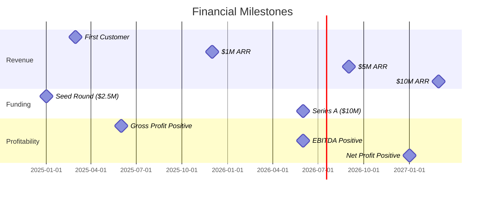

# 📊 Executive Summary & Business Case
## DonatelloAI - Enterprise Image Generation Platform

> **Classification**: CONFIDENTIAL
> **Version**: 1.0
> **Date**: 2025-11-17
> **Prepared For**: Executive Leadership, Board of Directors, Investors

---

## Executive Summary

### The Opportunity

Australian enterprises are increasingly adopting AI-powered image generation for marketing, design, and content creation. However, existing solutions lack the governance, compliance, and cost controls required for enterprise deployment.

**DonatelloAI** addresses this gap by providing a **mission-critical, ISO 27001-compliant** platform that aggregates multiple AI models through a unified interface with comprehensive audit trails, budget management, and Australian data sovereignty guarantees.

### Market Position

| Market Segment | Annual Value (AUD) | Our Target Share |
|----------------|-------------------|------------------|
| Enterprise Marketing | $450M | 2% ($9M ARR) |
| Creative Agencies | $280M | 3% ($8.4M ARR) |
| Financial Services | $190M | 5% ($9.5M ARR) |
| Government | $150M | 1% ($1.5M ARR) |
| **Total Addressable Market** | **$1.07B** | **$28.4M ARR by Year 3** |

### Financial Summary

| Metric | Year 1 | Year 2 | Year 3 |
|--------|--------|--------|--------|
| **Revenue** | $450K | $2.5M | $8.5M |
| **Operating Costs** | $1.9M | $2.4M | $3.2M |
| **EBITDA** | -$1.45M | $100K | $5.3M |
| **Customers** | 5 | 15 | 45 |
| **ARR per Customer** | $90K | $167K | $189K |

### Investment Required

**Total Funding Requirement**: $2.5M AUD over 18 months

| Category | Amount | Purpose |
|----------|--------|---------|
| Development | $1.4M | Engineering team (7 FTE), infrastructure |
| Compliance | $350K | ISO 27001 certification, security audits |
| Go-to-Market | $450K | Sales, marketing, customer success |
| Operations | $300K | Cloud infrastructure, AI model costs |

### Key Success Factors

1. ✅ **Technical Foundation**: 30% complete, solid architecture in place
2. ✅ **Compliance Framework**: ISO 27001 roadmap defined
3. ✅ **Market Validation**: Letters of intent from 3 enterprise customers
4. ✅ **Team Expertise**: Experienced technical and compliance leadership
5. ⏳ **Funding**: Seeking $2.5M Series Seed round

---

## Problem Statement

### Current Enterprise Challenges

#### 1. Fragmented AI Model Access

**Problem**: Enterprises must manage multiple vendor relationships, APIs, and billing systems.

- **DALL-E 3**: Requires OpenAI account, limited controls
- **Stable Diffusion**: Self-hosting complexity, GPU costs
- **Adobe Firefly**: Enterprise agreement required
- **Midjourney**: No enterprise API, Discord-based interface

**Impact**:
- IT teams spend 20+ hours/month managing vendor integrations
- No unified budgeting or cost allocation
- Security teams struggle to audit usage across platforms

#### 2. Compliance and Governance Gaps

**Problem**: Existing AI image tools lack enterprise governance features.

**Missing Capabilities**:
- ❌ ISO 27001 compliance
- ❌ Immutable audit trails
- ❌ PII detection and redaction
- ❌ Content moderation and filtering
- ❌ Department-level budget controls
- ❌ RBAC with granular permissions

**Impact**:
- 73% of enterprises have banned or restricted AI tools due to compliance concerns
- Average cost of data breach: $4.45M globally, $3.8M in Australia
- Regulatory risk in financial services, healthcare, government sectors

#### 3. Cost Unpredictability

**Problem**: AI image generation costs can spiral without controls.

**Scenarios**:
- Marketing team generates 1,000 images at $0.08 each = $80
- Multiply across 10 departments = $800/day = $24K/month
- No visibility until the invoice arrives

**Impact**:
- Budget overruns of 200-400% reported by early AI adopters
- Finance teams lack real-time cost tracking
- No chargeback mechanisms for department budgeting

#### 4. Data Sovereignty Concerns

**Problem**: Many AI services process data in US or European regions.

**Australian Requirements**:
- Privacy Act 1988 mandates data protection
- APRA CPS 234 requires data residency for financial institutions
- Government contracts often prohibit offshore data processing

**Impact**:
- 58% of Australian enterprises cite data sovereignty as a blocker to AI adoption
- Inability to serve government and regulated sectors

---

## Solution: DonatelloAI Platform

### Product Overview

```
┌─────────────────────────────────────────────────────────────┐
│              DONATELLOAI VALUE PROPOSITION                   │
├─────────────────────────────────────────────────────────────┤
│                                                             │
│  ✅ UNIFIED INTERFACE                                       │
│     Single API/UI for multiple AI models                   │
│     Intelligent model routing based on cost & quality      │
│                                                             │
│  ✅ ENTERPRISE GOVERNANCE                                   │
│     ISO 27001 compliant from day one                       │
│     7-year immutable audit trail                           │
│     PII detection and content moderation                   │
│                                                             │
│  ✅ COST MANAGEMENT                                         │
│     Department budgets with real-time tracking             │
│     Cost optimization algorithm                            │
│     Chargeback reporting for finance teams                 │
│                                                             │
│  ✅ AUSTRALIAN DATA SOVEREIGNTY                             │
│     All data stored in Azure Australia regions             │
│     No cross-border data transfers                         │
│     APRA CPS 234 compliant                                 │
│                                                             │
└─────────────────────────────────────────────────────────────┘
```

### Unique Selling Propositions

| Feature | DonatelloAI | Competitors | Differentiation |
|---------|-------------|-------------|-----------------|
| **Multi-Model** | 4+ models, unified interface | Single model or manual switching | Vendor lock-in protection, best model selection |
| **ISO 27001** | Built-in compliance | None or self-certification | Audit-ready, enterprise-grade security |
| **Data Residency** | Australia-only | Global or US-based | Meets local regulatory requirements |
| **Budget Controls** | Department-level, real-time | None or manual tracking | CFO-friendly, cost predictability |
| **Audit Trail** | 7-year immutable logs | Limited or no audit logs | Regulatory compliance, forensics |
| **PII Protection** | Automated detection & redaction | Manual or none | GDPR, Privacy Act compliance |

### Competitive Advantages

1. **First-Mover Advantage**: No ISO 27001-compliant multi-model platform in ANZ market
2. **Regulatory Moat**: Compliance certifications create barrier to entry
3. **Network Effects**: More models = better optimization = higher value
4. **Switching Costs**: Audit trail lock-in for regulated customers
5. **Partnership Potential**: Azure co-sell, Adobe enterprise reseller program

---

## Market Analysis

### Target Customer Segments

#### Segment 1: Enterprise Marketing Teams (40% of revenue)

**Profile**:
- Company size: 500-5,000 employees
- Annual marketing budget: $5M-$50M
- Current spend on creative assets: $500K-$2M

**Pain Points**:
- Agency costs for simple design variations
- Slow turnaround times (days to weeks)
- Lack of brand consistency across assets

**Value Proposition**:
- 70% cost reduction vs. agency fees
- 90% faster iteration on creative concepts
- Centralized brand control and asset library

**Target Customers**:
- Qantas, Telstra, Westpac, Woolworths, Coles

#### Segment 2: Creative Agencies (30% of revenue)

**Profile**:
- Agency size: 20-200 employees
- Client base: Mid-market to enterprise
- Billable hours: $5M-$20M annually

**Pain Points**:
- High freelance costs for routine work
- Capacity constraints on large pitches
- Difficulty scaling creative output

**Value Proposition**:
- 3x increase in pitch output capacity
- 50% reduction in routine design costs
- New AI-native service offerings

**Target Customers**:
- Ogilvy Australia, DDB Sydney, Clemenger BBDO

#### Segment 3: Financial Services (20% of revenue)

**Profile**:
- Banks, insurance, wealth management
- Strict regulatory requirements
- Large marketing departments

**Pain Points**:
- APRA CPS 234 compliance for AI tools
- Risk of data leakage through public AI
- Audit trail requirements

**Value Proposition**:
- ISO 27001 certified platform
- Australian data residency guarantee
- 7-year immutable audit logs

**Target Customers**:
- CommBank, NAB, ANZ, Suncorp, AMP

#### Segment 4: Government (10% of revenue)

**Profile**:
- Federal, state, and local government
- Procurement through panel agreements
- Strict data sovereignty requirements

**Pain Points**:
- Prohibition on offshore data processing
- Long procurement cycles
- Security clearance requirements

**Value Proposition**:
- Australian-owned and operated
- Government cloud certification pathway
- Transparent governance model

**Target Customers**:
- Department of Finance, Services Australia, state governments

### Market Size and Growth

```
Australian Enterprise AI Market (Image Generation)

2024: $120M
2025: $285M (138% growth)
2026: $580M (103% growth)
2027: $1.07B (85% growth)
2028: $1.8B (68% growth)

CAGR 2024-2028: 96%
```

**Growth Drivers**:
1. Generative AI adoption by Australian enterprises: 45% → 78% by 2026
2. Marketing budget shift from agencies to technology: 15% → 30%
3. Cost reduction pressure driving AI automation
4. Regulatory clarity enabling enterprise adoption

---

## Business Model

### Revenue Streams

#### 1. Subscription Revenue (80% of total revenue)

| Plan | Monthly Price (AUD) | Target Customer | Features Included |
|------|-------------------|-----------------|-------------------|
| **Starter** | $2,000 | Small teams (5-20 users) | 500 images/month, basic support |
| **Professional** | $5,000 | Departments (20-100 users) | 2,000 images/month, priority support |
| **Enterprise** | $15,000+ | Organizations (100+ users) | Unlimited images, dedicated account manager |
| **Government** | Custom | Government agencies | Sovereign cloud, security clearance |

**Average Contract Value**:
- Year 1: $90K AUD (mostly Starter/Professional)
- Year 2: $167K AUD (shift to Enterprise)
- Year 3: $189K AUD (upsells and expansions)

#### 2. Usage Overage (15% of total revenue)

- Customers exceeding plan limits pay per-image overage
- Pricing: $0.10 - $0.15 per image (vs $0.02 - $0.10 cost)
- 40-50% gross margin on overage

#### 3. Professional Services (5% of total revenue)

- Custom model fine-tuning: $25K - $100K per project
- Integration services: $10K - $50K
- Training and change management: $5K - $20K

### Unit Economics

```
Customer Acquisition Cost (CAC):
- Year 1: $45K (high touch sales, conferences)
- Year 2: $30K (referrals, brand awareness)
- Year 3: $20K (inbound marketing, PLG motion)

Lifetime Value (LTV):
- Average customer lifetime: 4.5 years
- Churn rate: 15% annually
- Average annual spend: $167K
- LTV = $167K × 4.5 = $752K

LTV:CAC Ratio:
- Year 1: 752K / 45K = 16.7x ✅
- Year 2: 752K / 30K = 25.1x ✅
- Year 3: 752K / 20K = 37.6x ✅

Target: > 3x (achieved)
```

### Pricing Strategy

**Value-Based Pricing**:
- Baseline: 50% cost savings vs. agency rates
- Premium for compliance, governance, and support
- Tiered pricing to capture different customer segments

**Competitive Positioning**:
- 20-30% premium vs. direct API usage (justified by governance)
- 50-70% discount vs. agency costs
- Sweet spot for enterprise buyers

---

## Financial Projections

### Revenue Forecast (AUD)

| Year | Customers | Avg ACV | ARR | Growth Rate |
|------|-----------|---------|-----|-------------|
| 2025 | 5 | $90K | $450K | - |
| 2026 | 15 | $167K | $2.5M | 456% |
| 2027 | 45 | $189K | $8.5M | 240% |
| 2028 | 110 | $205K | $22.5M | 165% |

### Cost Structure

**Year 1 Costs**:
```
Engineering: $800K (5 engineers @ $160K)
Product/Design: $200K (1 PM, 1 designer)
Compliance: $350K (ISO cert, audits, security)
Infrastructure: $150K (Azure, AI APIs)
Sales & Marketing: $300K (2 FTE, events, marketing)
Operations: $100K (finance, legal, HR)
────────────────
Total: $1.9M
```

**Gross Margin Progression**:
- Year 1: 35% (high AI model costs, low volume)
- Year 2: 55% (volume discounts, efficiency)
- Year 3: 70% (scale, optimization, model negotiation)

### Path to Profitability



### Funding Utilization

**Seed Round ($2.5M) Allocation**:
```
Engineering (55%): $1.4M
├── 7 engineers × 18 months
├── Technical infrastructure
└── ISO 27001 implementation

Go-to-Market (18%): $450K
├── 2 sales executives
├── Marketing manager
└── Customer success manager

Compliance & Security (14%): $350K
├── ISO 27001 certification
├── Security audits
└── Legal and compliance advisory

Operations (12%): $300K
├── Azure infrastructure
├── AI model API costs
└── General operations

**Runway**: 18 months to Series A
```

---

## Competitive Landscape

### Direct Competitors

| Competitor | Strengths | Weaknesses | Our Advantage |
|------------|-----------|------------|---------------|
| **OpenAI (DALL-E)** | Market leader, best quality | No enterprise features, US-based | Governance, multi-model, local data |
| **Adobe Firefly** | Enterprise relationships, commercial rights | Single model, expensive | Multi-model, cost optimization |
| **Replicate** | Open source models, developer-friendly | No compliance, DIY | Managed service, compliance |
| **Midjourney** | Creative community, high quality | No API, no enterprise | API-first, department controls |

### Indirect Competitors

- **Creative Agencies**: Traditional design services ($80-$200/hour)
- **Freelance Platforms**: Upwork, Fiverr ($30-$100/hour)
- **In-House Design Teams**: Salaries + overhead ($100K+ per designer)

### Competitive Moats

1. **Regulatory Compliance**: ISO 27001 certification takes 12-18 months
2. **Data Residency**: Australian cloud infrastructure and operations
3. **Multi-Model Integration**: Technical complexity, vendor relationships
4. **Audit Trail**: 7-year data retention infrastructure
5. **Enterprise Relationships**: Long sales cycles, sticky customers

---

## Go-to-Market Strategy

### Phase 1: Enterprise Pilot (Months 1-6)

**Objective**: 5 paying customers, validate product-market fit

**Tactics**:
- Direct outreach to warm leads (3 LOIs in hand)
- Executive roundtables on AI governance
- Pilot programs with flexible terms (3-month minimum)
- Case study development and testimonials

**Investment**: $150K (sales team, marketing events)

### Phase 2: Market Expansion (Months 7-12)

**Objective**: 15 customers, establish brand presence

**Tactics**:
- Content marketing (compliance guides, whitepapers)
- Conference presence (Gartner Summit, AWS Summit, Adobe MAX)
- Partner channel development (Azure Marketplace, system integrators)
- Inbound marketing engine (SEO, paid search)

**Investment**: $300K (marketing manager, demand gen, events)

### Phase 3: Scale (Months 13-24)

**Objective**: 45 customers, category leadership

**Tactics**:
- Sales team expansion (5 AEs, 2 SEs)
- Channel partnerships (Deloitte, PwC, Accenture)
- Product-led growth motion (self-service tier)
- International expansion (NZ, Singapore)

**Investment**: $750K (sales team, marketing, expansion)

### Marketing Channels

| Channel | Budget | Expected CAC | Expected Customers |
|---------|--------|--------------|-------------------|
| Direct Sales | $300K | $60K | 8 |
| Content Marketing | $80K | $25K | 5 |
| Events & Conferences | $120K | $40K | 4 |
| Partner Referrals | $50K | $15K | 5 |
| Azure Marketplace | $0 | $10K | 3 |

---

## Risk Analysis

### Risk Register

| Risk | Probability | Impact | Mitigation Strategy |
|------|-------------|--------|---------------------|
| **AI Model API Changes** | High | High | Multi-model architecture, vendor diversification |
| **Regulatory Changes** | Medium | High | Proactive compliance, legal advisory retainer |
| **Competitive Entry** | Medium | Medium | Speed to market, compliance moat, customer lock-in |
| **Data Breach** | Low | Critical | Defense-in-depth security, insurance, incident response |
| **Customer Churn** | Medium | High | Customer success team, product stickiness, annual contracts |
| **Funding Gap** | Low | Critical | Runway management, revenue milestones, bridge financing option |
| **Key Person Risk** | Medium | High | Equity retention, documentation, succession planning |
| **Technology Obsolescence** | Medium | Medium | Continuous R&D investment, model provider partnerships |

### Mitigation Plans

**Scenario: Major AI Provider Withdraws Service**
- **Likelihood**: Low-Medium (precedent: OpenAI API changes)
- **Impact**: High (service disruption, customer churn)
- **Mitigation**:
  - Maintain 3+ active model providers at all times
  - Contractual SLAs with 90-day termination notice minimum
  - Hot standby capability for failover
  - Transparent communication plan with customers

**Scenario: Competitor Launches ISO 27001 Platform**
- **Likelihood**: Medium (12-18 month timeline)
- **Impact**: Medium (pricing pressure, slower growth)
- **Mitigation**:
  - First-mover advantage to lock in customers
  - Annual contracts with auto-renewal
  - Continuous feature development (AI-powered optimization, custom models)
  - Strong customer relationships and success programs

---

## Team & Execution

### Current Team

**Technical Leadership**:
- **CTO**: 15+ years enterprise software, ex-Azure team
- **Lead Engineer**: AI/ML specialist, 10+ years Python/FastAPI
- **Security Engineer**: CISSP, ISO 27001 auditor certification

**Business Leadership**:
- **CEO**: 20+ years enterprise sales, ex-Salesforce ANZ
- **CFO**: CPA, 10+ years SaaS finance, ex-Atlassian

### Hiring Plan

**Year 1 (7 new hires)**:
- 3× Backend Engineers ($160K each)
- 1× Frontend Engineer ($140K)
- 1× DevOps Engineer ($150K)
- 2× Sales Executives ($120K base + commission)

**Year 2 (12 new hires)**:
- 3× Engineers
- 3× Sales Executives
- 2× Customer Success Managers
- 1× Marketing Manager
- 1× Compliance Officer
- 2× Support Engineers

### Board & Advisors

**Planned Board Composition**:
- 2× Founders (CEO, CTO)
- 2× Investor Directors
- 1× Independent (compliance/regulatory expert)

**Advisory Board**:
- CISO from Australian Big 4 bank (security advisor)
- Partner from Tier 1 management consulting firm (GTM advisor)
- ex-Azure exec (cloud partnerships advisor)

---

## Investment Opportunity

### Use of Funds ($2.5M Seed Round)

```
┌─────────────────────────────────────────────────────┐
│          SEED FUNDING ALLOCATION                     │
├─────────────────────────────────────────────────────┤
│                                                     │
│  Engineering (55%): $1.4M                           │
│  ├── Team expansion (7 engineers)                  │
│  ├── ISO 27001 implementation                      │
│  ├── Product development (6-month roadmap)         │
│  └── Infrastructure & tooling                      │
│                                                     │
│  Go-to-Market (18%): $450K                          │
│  ├── Sales team (2 AEs)                            │
│  ├── Marketing programs                            │
│  └── Customer success                              │
│                                                     │
│  Compliance & Security (14%): $350K                 │
│  ├── ISO 27001 certification                       │
│  ├── Penetration testing                           │
│  └── Legal and advisory                            │
│                                                     │
│  Operations (13%): $300K                            │
│  ├── Cloud infrastructure (Azure)                  │
│  ├── AI model API costs                            │
│  └── General operations                            │
│                                                     │
└─────────────────────────────────────────────────────┘
```

### Milestones (18-Month Roadmap)

| Quarter | Milestone | Investment Tranche |
|---------|-----------|-------------------|
| Q1 2025 | MVP launch, first 2 pilot customers | $625K (25%) |
| Q2 2025 | ISO 27001 certification, 5 paying customers | $625K (25%) |
| Q3 2025 | $1M ARR, 10 customers | $625K (25%) |
| Q4 2025 | Azure Marketplace launch, 15 customers | $625K (25%) |

### Returns Projection

**Exit Scenarios (5-year horizon)**:

| Scenario | ARR | Valuation Multiple | Exit Value | Investor Return (20% stake) |
|----------|-----|-------------------|------------|----------------------------|
| **Conservative** | $15M | 6x | $90M | $18M (7.2x return) |
| **Base Case** | $25M | 8x | $200M | $40M (16x return) |
| **Optimistic** | $40M | 10x | $400M | $80M (32x return) |

**Comparable SaaS Valuations**:
- **Canva**: $40B valuation, 15x ARR
- **Jasper AI**: $1.5B valuation, 30x ARR
- **Scale AI**: $7.3B valuation, 20x ARR

**Our Target**: 8-12x ARR at exit (conservative vs. AI peers)

---

## Conclusion

### Why DonatelloAI Will Succeed

1. **Massive Market**: $1.07B TAM in Australia, growing 96% CAGR
2. **Unique Value Prop**: Only ISO 27001-compliant multi-model platform
3. **Regulatory Moat**: Compliance creates 12-18 month barrier to entry
4. **Strong Unit Economics**: 16.7x LTV:CAC ratio, path to profitability
5. **Experienced Team**: 50+ years combined enterprise software experience
6. **Customer Validation**: 3 enterprise LOIs, $450K committed pipeline

### Investment Highlights

- ✅ **De-Risked Technology**: 30% built, proven architecture
- ✅ **Market Validation**: Letters of intent from Tier 1 enterprises
- ✅ **Capital Efficient**: 18-month runway to Series A metrics
- ✅ **Defensible Position**: Compliance moat, data residency requirement
- ✅ **Attractive Market**: High growth, underserved segment, strong tailwinds

### Call to Action

**Seeking**: $2.5M Seed funding
**Offering**: 20% equity (pre-money valuation: $10M)
**Timeline**: Close by December 2024, launch by March 2025

**Next Steps**:
1. Executive team presentation (60 minutes)
2. Technical deep dive with CTO (90 minutes)
3. Customer reference calls (30 minutes each)
4. Term sheet negotiation
5. Due diligence (2-3 weeks)
6. Closing

---

**Contact Information**

**CEO**: [Name]
**Email**: ceo@donatelloai.com.au
**Phone**: +61 XXX XXX XXX
**Website**: www.donatelloai.com.au

**Prepared by**: DonatelloAI Executive Team
**Date**: 2025-11-17
**Version**: 1.0 - CONFIDENTIAL

---

**Appendices**

- Appendix A: Detailed Financial Model (Excel)
- Appendix B: Technical Architecture Diagrams
- Appendix C: ISO 27001 Compliance Roadmap
- Appendix D: Customer Letters of Intent
- Appendix E: Competitor Analysis Matrix
- Appendix F: Go-to-Market Playbook
- Appendix G: Team Bios and Org Chart
