# 📊 Data Flow Diagrams
## Enterprise Image Generation Platform (DonatelloAI)

> **Version**: 1.0
> **Date**: 2025-11-17
> **Format**: Mermaid Diagrams

---

## Table of Contents

1. [Authentication Flow](#authentication-flow)
2. [Image Generation Flow](#image-generation-flow)
3. [Budget Enforcement Flow](#budget-enforcement-flow)
4. [User Management Flow](#user-management-flow)
5. [Audit Logging Flow](#audit-logging-flow)
6. [Model Selection Flow](#model-selection-flow)
7. [Error Handling Flow](#error-handling-flow)
8. [Webhook Notification Flow](#webhook-notification-flow)

---

## Authentication Flow

### User Login Flow (OAuth 2.0 + OpenID Connect)

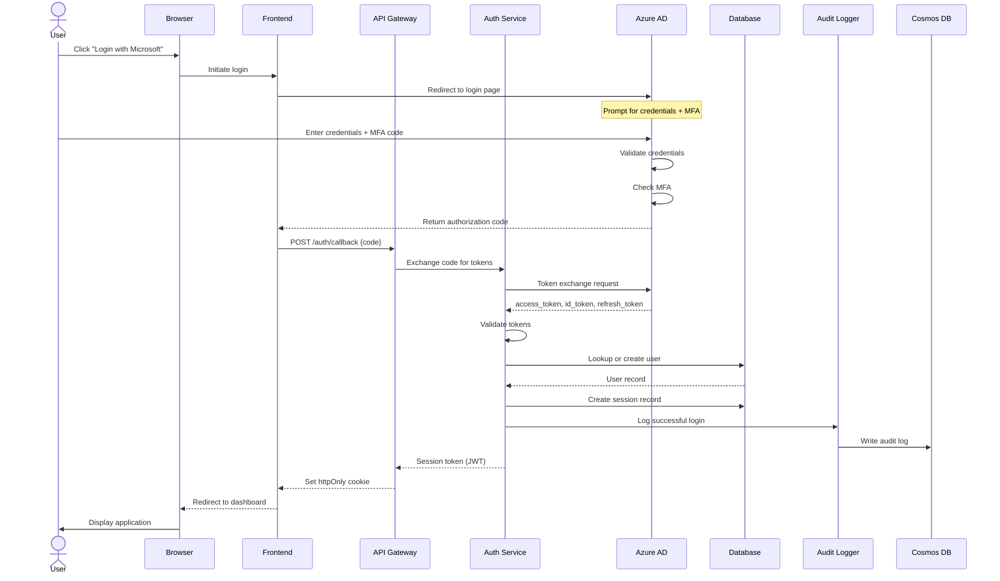

### Token Refresh Flow

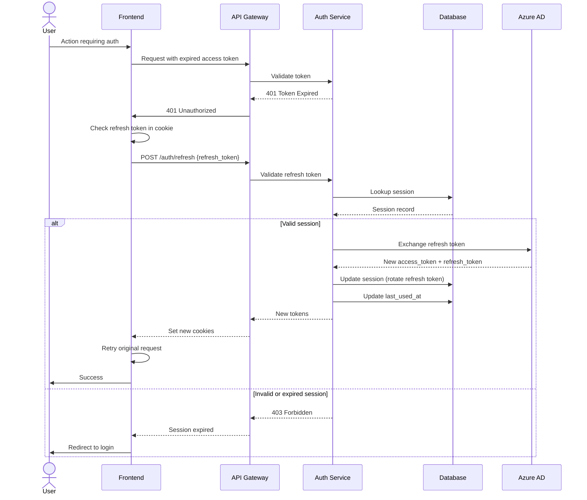

---

## Image Generation Flow

### Complete Generation Workflow

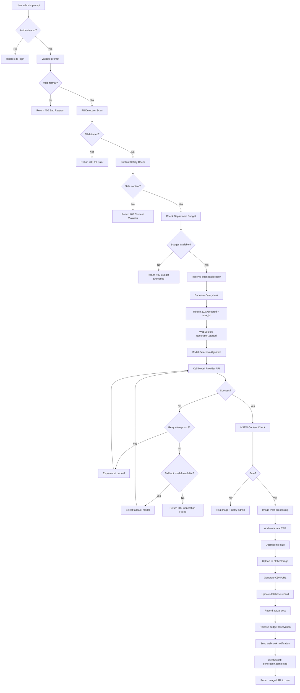

### Detailed Generation Sequence

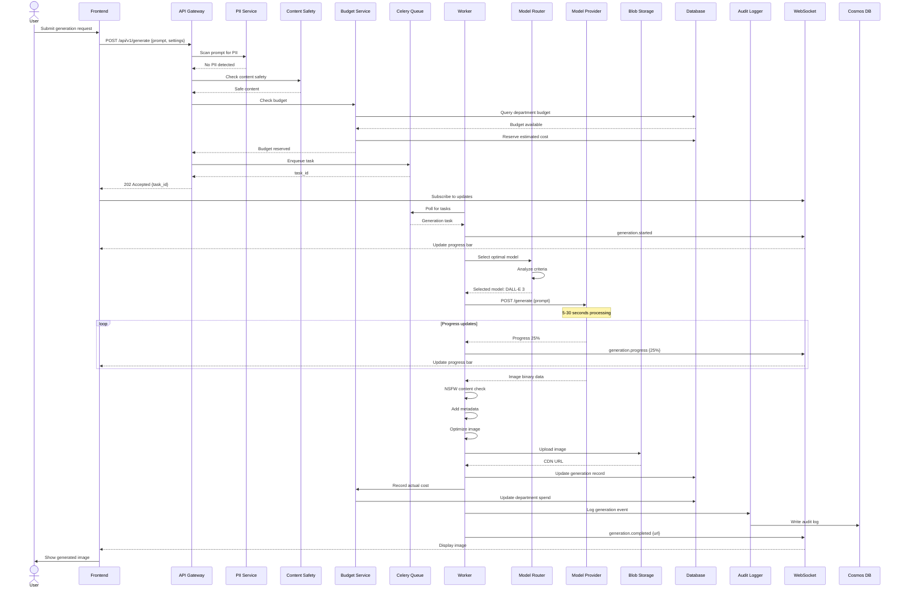

---

## Budget Enforcement Flow

### Budget Check and Enforcement

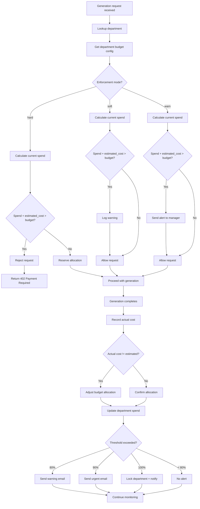

### Budget Alert Flow

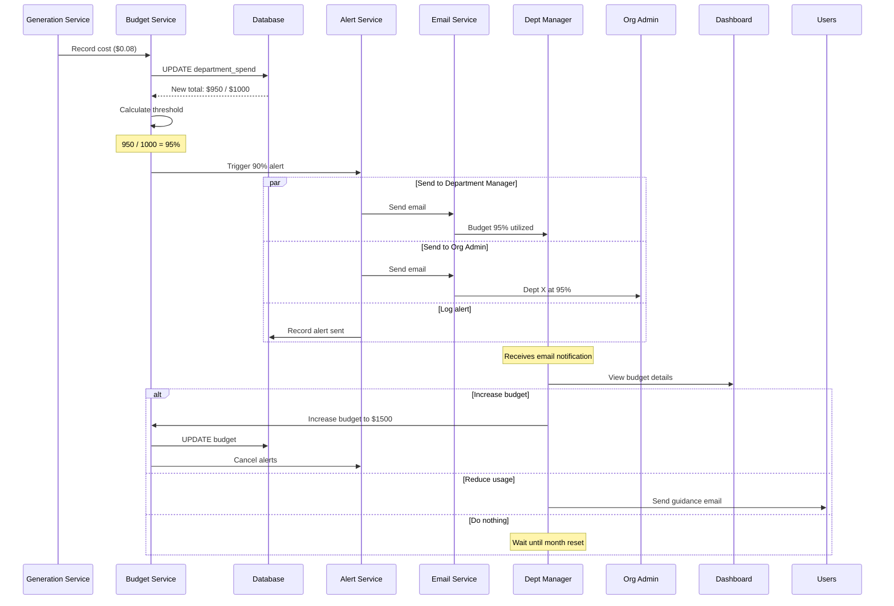

---

## User Management Flow

### User Provisioning Workflow

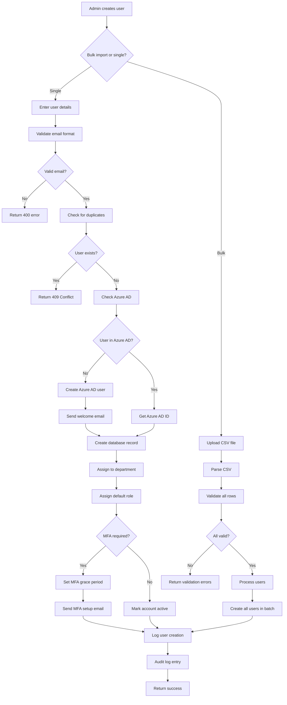

### User Deactivation Flow

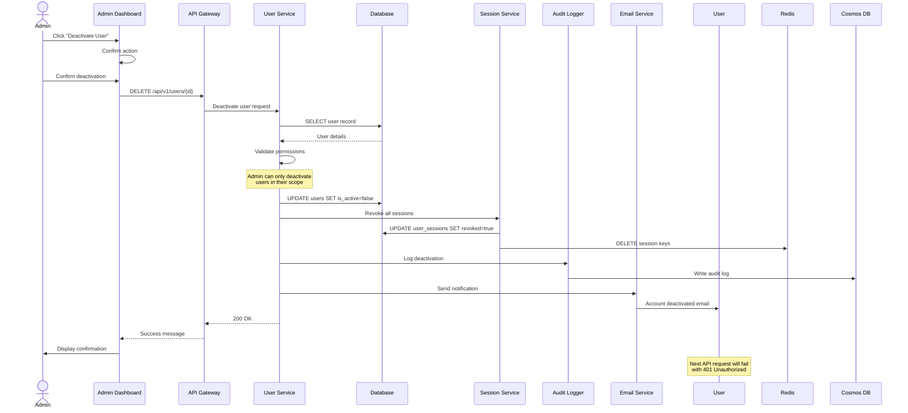

---

## Audit Logging Flow

### Comprehensive Audit Trail

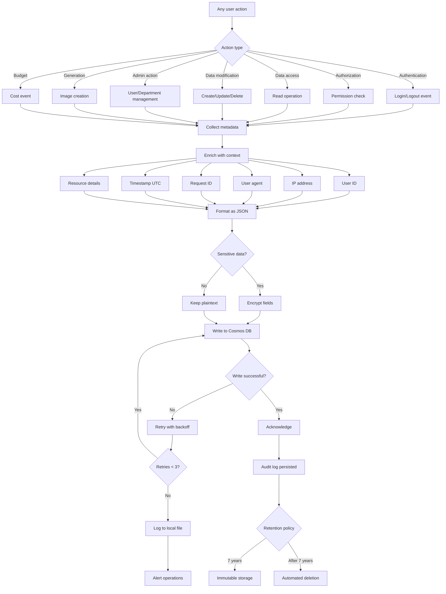

### Audit Log Query Flow

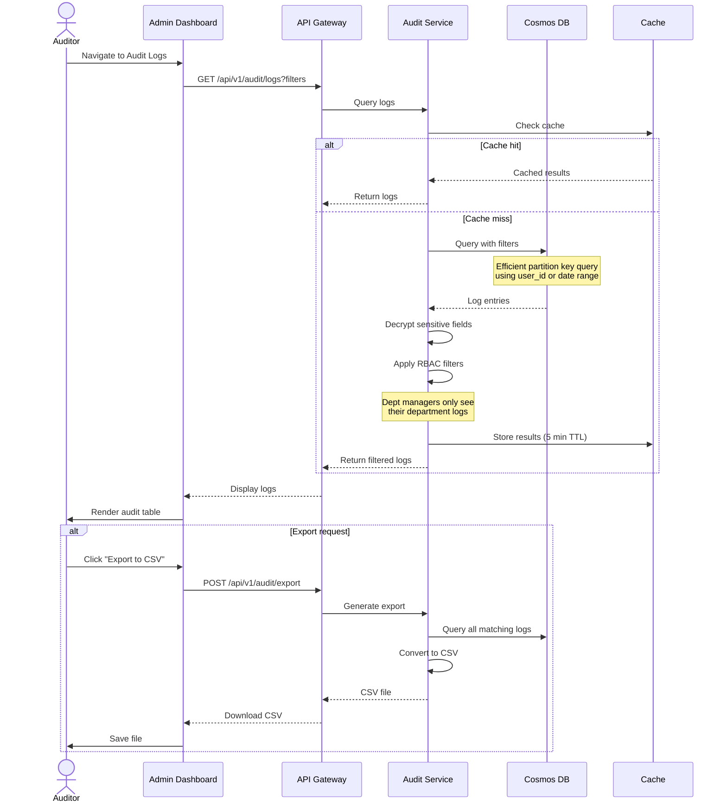

---

## Model Selection Flow

### Intelligent Model Selection Algorithm

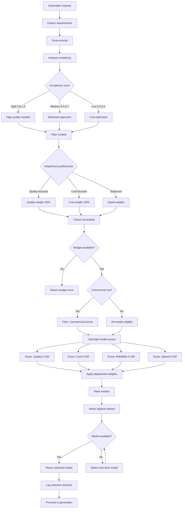

### Model Fallback Strategy

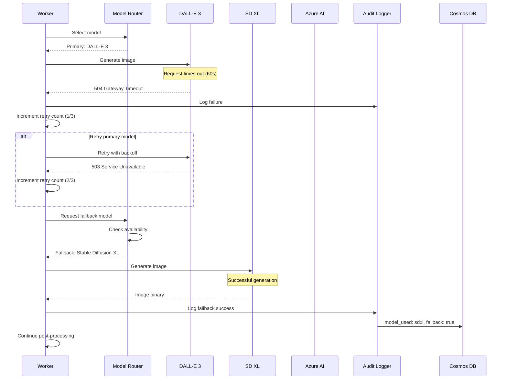

---

## Error Handling Flow

### Global Error Handling

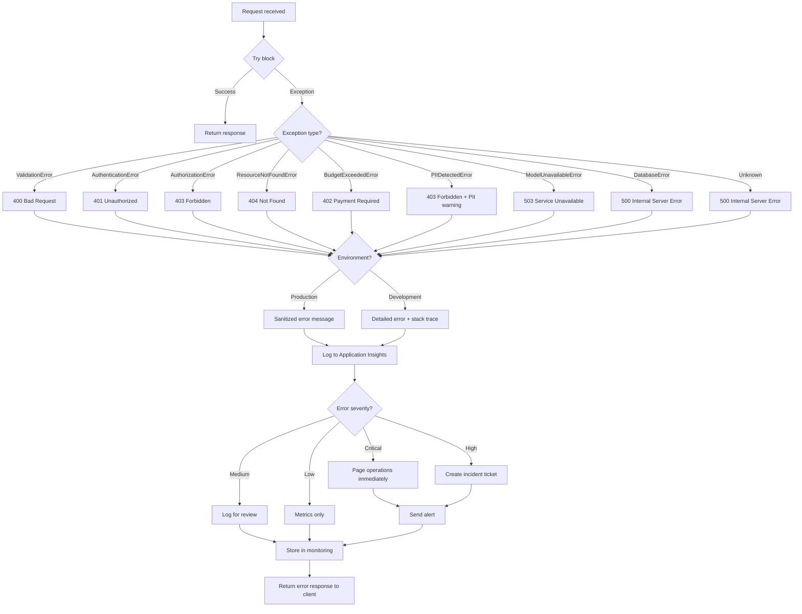

### Retry Logic with Exponential Backoff

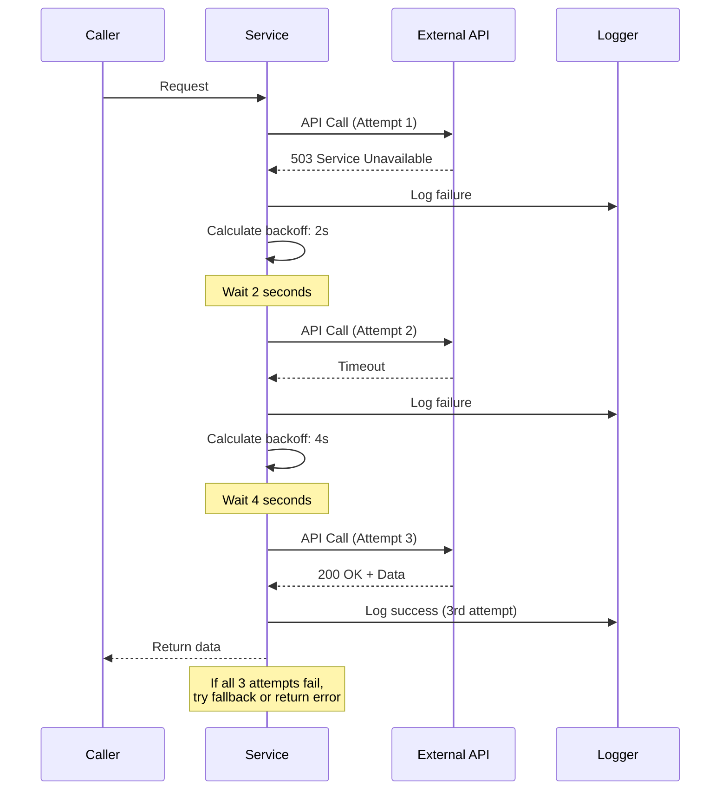

---

## Webhook Notification Flow

### Webhook Event Delivery

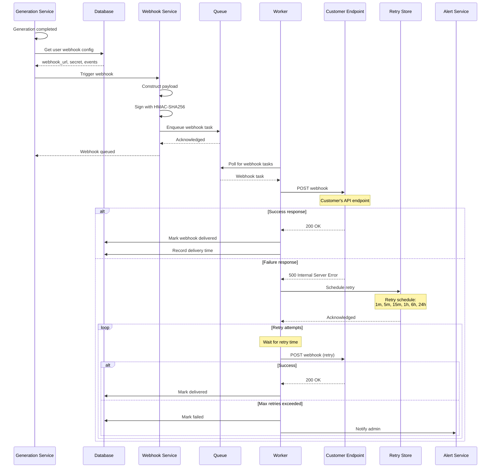

---

## System Integration Dataflow

### End-to-End Data Flow

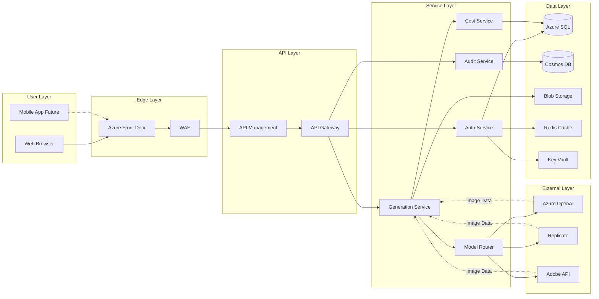

---

## Document Control

| Field | Value |
|-------|-------|
| Version | 1.0 |
| Author | DonatelloAI Architecture Team |
| Date | 2025-11-17 |
| Review Date | 2026-02-17 |
| Classification | CONFIDENTIAL |

---

**Usage Notes**:
- All diagrams are rendered using Mermaid syntax
- View in GitHub, GitLab, or any Mermaid-compatible viewer
- Export to PNG/SVG using Mermaid CLI or online tools
- Update diagrams when architecture changes

---

**Related Documentation**:
- [System Architecture](../architecture/SYSTEM_ARCHITECTURE.md)
- [API Specification](../api/openapi.yaml)
- [Database Schema](../architecture/DATABASE_SCHEMA.md)
- [Security Architecture](../architecture/SECURITY_ARCHITECTURE.md)
